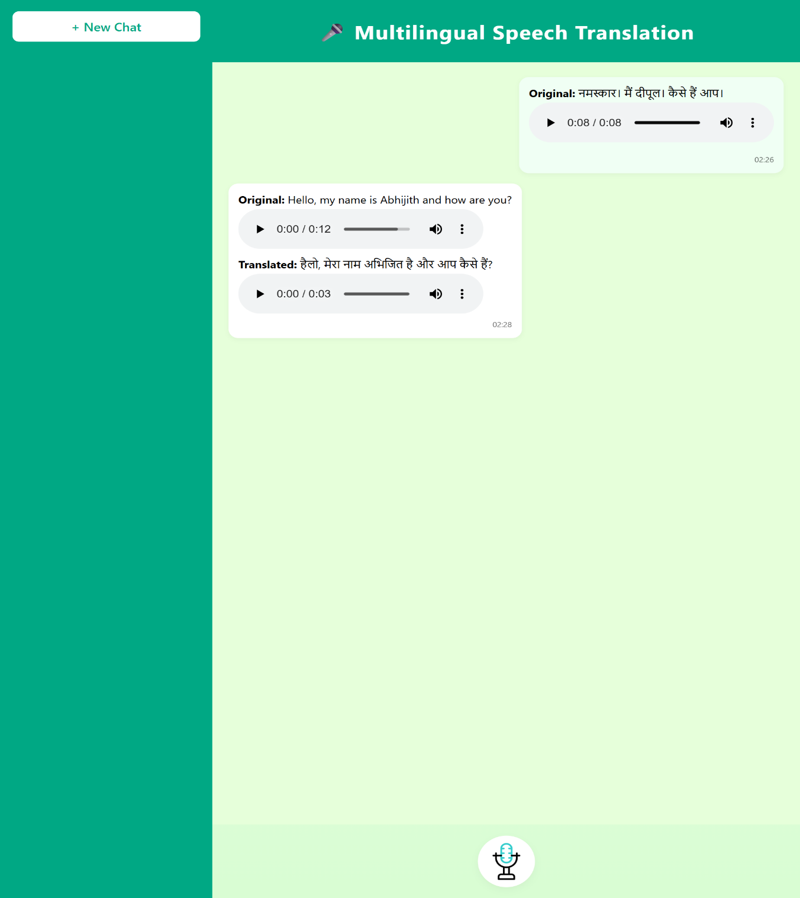
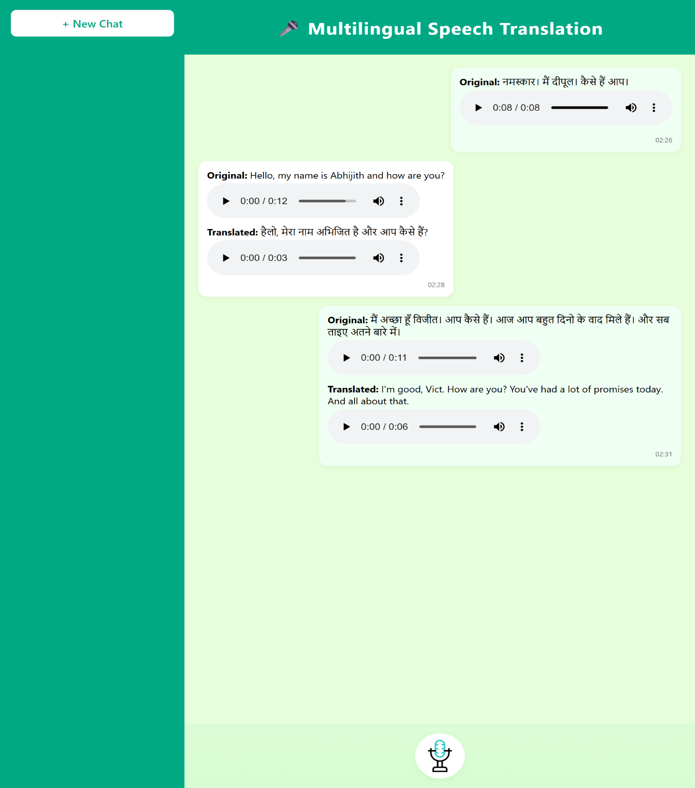

# Speech Assessment System

## Project Overview

This project is an AI-powered Speech Assessment System that evaluates pronunciation, speech quality, and transcription using Whisper AI and Speech Processing.

The system includes:

* Speech-to-Text conversion
* Pronunciation assessment
* Audio processing
* Translation support
* Speaker identification

## Technologies Used

### Backend

* Java
* Spring Boot
* Maven

### AI / Speech Processing

* Python
* Flask
* Whisper AI
* SpeechBrain

### Frontend

* HTML
* CSS
* JavaScript

## Features

* Upload audio
* Speech transcription
* Pronunciation analysis
* Speaker detection
* Audio processing

## Project Structure

Project/
├── speechassessment/ (Spring Boot Application)
├── whisper-services/ (Python AI Services)
└── sampleAudio/

## Installation

### Clone Project

```bash
git clone https://github.com/Dipulkumar/speechassessment.git
```

### Run Spring Boot

```bash
cd speechassessment
mvn spring-boot:run
```

### Run Python Service

```bash
cd whisper-services
pip install -r requirements.txt
python app.py
```

## Author

Dipul Kumar


## Screenshots

### Home Page


### Speech to Text


### Language Detection

